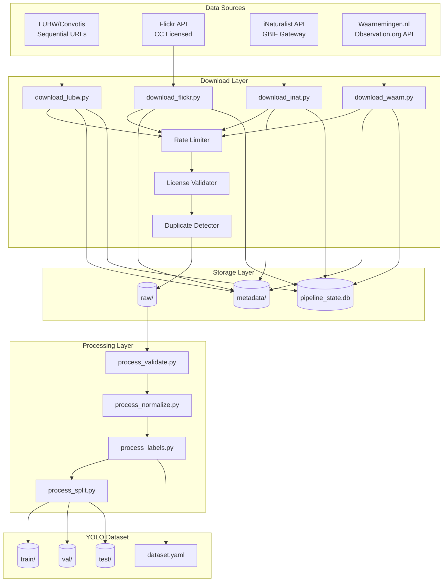

# Hornet-Data Pipeline Architecture

> Data Acquisition Pipeline for YOLO Training Dataset Generation
> Target Species: *Vespa velutina*, *Vespa crabro*, *Vespula vulgaris*, *Apis mellifera*

---

## Table of Contents

1. [Architecture Overview](#1-architecture-overview)
2. [Module Structure](#2-module-structure)
3. [Data Flow](#3-data-flow)
4. [Error Handling & Retry Strategy](#4-error-handling--retry-strategy)
5. [Progress Tracking](#5-progress-tracking)
6. [Library Recommendations](#6-library-recommendations)

---

## 1. Architecture Overview

### High-Level Pipeline Diagram

```
┌─────────────────────────────────────────────────────────────────────────────┐
│                           DATA SOURCES                                       │
├─────────────────┬─────────────────┬──────────────────┬─────────────────────┤
│  LUBW/Convotis  │  Flickr API     │  iNaturalist API │  Waarnemingen.nl    │
│  (Sequential    │  (CC Licensed)  │  (CC0/CC-BY)     │  (Observations)     │
│   URL Pattern)  │                 │                  │                     │
└────────┬────────┴────────┬────────┴─────────┬────────┴──────────┬──────────┘
         │                 │                  │                   │
         ▼                 ▼                  ▼                   ▼
┌─────────────────────────────────────────────────────────────────────────────┐
│                      DOWNLOAD LAYER (scripts/download_*.py)                  │
│  ┌─────────────────────────────────────────────────────────────────────┐    │
│  │  - Rate Limiting (respect API limits)                                │    │
│  │  - License Validation (CC0/CC-BY only)                               │    │
│  │  - Duplicate Detection (SHA256 hash)                                 │    │
│  │  - Retry with Exponential Backoff                                    │    │
│  └─────────────────────────────────────────────────────────────────────┘    │
└─────────────────────────────────────────────────────────────────────────────┘
         │
         ▼
┌─────────────────────────────────────────────────────────────────────────────┐
│                         RAW DATA STORAGE                                     │
│  raw/                                                                        │
│  ├── lubw/           ─── YYYY-MM/NNNN.ext                                   │
│  ├── flickr/         ─── {class}/{photo_id}.ext                             │
│  ├── inaturalist/    ─── {class}/{obs_id}.ext                               │
│  └── waarnemingen/   ─── {class}/{obs_id}.ext                               │
└─────────────────────────────────────────────────────────────────────────────┘
         │
         ▼
┌─────────────────────────────────────────────────────────────────────────────┐
│                     PROCESSING LAYER (scripts/process_*.py)                  │
│  ┌──────────────────┐  ┌──────────────────┐  ┌──────────────────┐          │
│  │ Image Validation │  │  Size Normalize  │  │  Auto-Label      │          │
│  │  - Format check  │  │  - Max 1920px    │  │  - Class assign  │          │
│  │  - Corrupt det.  │  │  - Aspect ratio  │  │  - BBox (YOLO)   │          │
│  └──────────────────┘  └──────────────────┘  └──────────────────┘          │
└─────────────────────────────────────────────────────────────────────────────┘
         │
         ▼
┌─────────────────────────────────────────────────────────────────────────────┐
│                       YOLO DATASET OUTPUT                                    │
│  processed/                                                                  │
│  ├── train/         ─── images/ + labels/                                   │
│  ├── val/           ─── images/ + labels/                                   │
│  └── test/          ─── images/ + labels/                                   │
│                                                                              │
│  metadata/                                                                   │
│  ├── sources.json           ─── Source attribution                          │
│  ├── pipeline_state.db      ─── SQLite progress tracking                    │
│  └── dataset.yaml           ─── YOLO config                                 │
└─────────────────────────────────────────────────────────────────────────────┘
```

### Component Interaction (Mermaid)



---

## 2. Module Structure

### Directory Layout

```
scripts/
├── __init__.py
├── config.py                    # Central configuration
├── models.py                    # Data classes & schemas
│├── download/
│   ├── __init__.py
│   ├── base.py                  # Abstract base downloader
│   ├── lubw.py                  # LUBW/Convotis sequential URL scanner
│   ├── flickr.py                # Flickr API client
│   ├── inaturalist.py           # iNaturalist/GBIF connector
│   └── waarnemingen.py          # Waarnemingen.nl/Observation.org
│├── process/
│   ├── __init__.py
│   ├── validate.py              # Image integrity & format checks
│   ├── normalize.py             # Resize, standardize dimensions
│   ├── labels.py                # YOLO label generation
│   └── split.py                 # Train/val/test splitting
│├── utils/
│   ├── __init__.py
│   ├── rate_limiter.py          # Token bucket rate limiting
│   ├── retry.py                 # Exponential backoff retry
│   ├── dedup.py                 # SHA256 duplicate detection
│   ├── license_check.py         # CC license validation
│   └── progress.py              # Progress tracking helpers
│├── cli.py                      # Command-line interface
└── run_pipeline.py              # Main orchestration script
```

### Module Descriptions

#### `config.py` - Central Configuration

```python
from dataclasses import dataclass
from pathlib import Path
from typing import Dict, List

@dataclass
class SourceConfig:
    """Configuration for a data source"""
    name: str
    enabled: bool
    rate_limit_per_second: float
    max_retries: int
    timeout_seconds: int
    license_whitelist: List[str]  # e.g., ["CC0", "CC-BY", "CC-BY-SA"]

@dataclass
class PipelineConfig:
    """Global pipeline configuration"""
    raw_dir: Path = Path("raw")
    processed_dir: Path = Path("processed")
    metadata_dir: Path = Path("metadata")
    db_path: Path = Path("metadata/pipeline_state.db")
    max_image_size: int = 1920
    train_val_test_split: tuple = (0.7, 0.2, 0.1)
    classes: Dict[int, str] = None
    
    def __post_init__(self):
        self.classes = {
            0: "vespa_velutina",    # Asian Hornet
            1: "vespa_crabro",      # European Hornet
            2: "vespula_vulgaris",  # Common Wasp
            3: "apis_mellifera",    # Honey Bee
        }

# Source-specific configs
SOURCES = {
    "lubw": SourceConfig(
        name="LUBW/Convotis",
        enabled=True,
        rate_limit_per_second=1.0,
        max_retries=5,
        timeout_seconds=30,
        license_whitelist=["unknown"],  # Government data, assumed OK
    ),
    "flickr": SourceConfig(
        name="Flickr",
        enabled=True,
        rate_limit_per_second=0.5,  # Flickr is strict
        max_retries=3,
        timeout_seconds=20,
        license_whitelist=["CC0", "CC-BY", "CC-BY-SA"],
    ),
    "inaturalist": SourceConfig(
        name="iNaturalist",
        enabled=True,
        rate_limit_per_second=2.0,
        max_retries=5,
        timeout_seconds=30,
        license_whitelist=["CC0", "CC-BY", "CC-BY-SA", "CC-BY-NC"],
    ),
    "waarnemingen": SourceConfig(
        name="Waarnemingen.nl",
        enabled=True,
        rate_limit_per_second=1.0,
        max_retries=3,
        timeout_seconds=20,
        license_whitelist=["CC0", "CC-BY"],
    ),
}
```

#### `models.py` - Data Classes

```python
from dataclasses import dataclass, field
from datetime import datetime
from enum import Enum
from typing import Optional
import hashlib

class DownloadStatus(Enum):
    PENDING = "pending"
    IN_PROGRESS = "in_progress"
    COMPLETED = "completed"
    FAILED = "failed"
    SKIPPED_DUPLICATE = "skipped_duplicate"
    SKIPPED_LICENSE = "skipped_license"

@dataclass
class ImageRecord:
    """Represents a downloaded image with full metadata"""
    id: str                           # Unique identifier
    source: str                       # lubw, flickr, inaturalist, waarnemingen
    source_url: str                   # Original URL
    local_path: str                   # Relative path in raw/
    sha256: str                       # Hash for deduplication
    class_id: int                     # 0-3
    class_name: str                   # Species name
    license: str                      # CC0, CC-BY, etc.
    photographer: Optional[str]       # Attribution
    downloaded_at: datetime
    size_bytes: int
    width: Optional[int] = None
    height: Optional[int] = None
    status: DownloadStatus = DownloadStatus.PENDING
    error_message: Optional[str] = None
    retry_count: int = 0
    metadata: dict = field(default_factory=dict)

    def compute_hash(self, file_path: str) -> str:
        """Compute SHA256 hash for deduplication"""
        h = hashlib.sha256()
        with open(file_path, "rb") as f:
            for chunk in iter(lambda: f.read(8192), b""):
                h.update(chunk)
        return h.hexdigest()

@dataclass
class PipelineState:
    """Tracks overall pipeline progress"""
    source: str
    total_found: int = 0
    total_downloaded: int = 0
    total_skipped: int = 0
    total_failed: int = 0
    last_run: Optional[datetime] = None
    last_scanned_id: Optional[str] = None  # For resumable scans
```

#### `download/base.py` - Abstract Base Downloader

```python
from abc import ABC, abstractmethod
from typing import Iterator, Optional
from pathlib import Path
import logging

from ..config import SourceConfig, PipelineConfig
from ..models import ImageRecord, DownloadStatus
from ..utils.rate_limiter import RateLimiter
from ..utils.retry import retry_with_backoff
from ..utils.dedup import DeduplicationStore
from ..utils.license_check import LicenseValidator

logger = logging.getLogger(__name__)

class BaseDownloader(ABC):
    """Abstract base class for all downloaders"""
    
    def __init__(self, config: SourceConfig, pipeline: PipelineConfig):
        self.config = config
        self.pipeline = pipeline
        self.rate_limiter = RateLimiter(config.rate_limit_per_second)
        self.dedup = DeduplicationStore(pipeline.db_path)
        self.license_validator = LicenseValidator(config.license_whitelist)
        self._setup_directories()
    
    def _setup_directories(self):
        """Ensure output directories exist"""
        for class_name in self.pipeline.classes.values():
            (self.pipeline.raw_dir / self.config.name.lower() / class_name).mkdir(
                parents=True, exist_ok=True
            )
    
    @abstractmethod
    def scan(self, **kwargs) -> Iterator[ImageRecord]:
        """Yield candidate images to download"""
        pass
    
    @abstractmethod
    def download(self, record: ImageRecord) -> Optional[Path]:
        """Download a single image, return local path or None on failure"""
        pass
    
    def process(self, **kwargs) -> Iterator[ImageRecord]:
        """Main processing loop with rate limiting, retry, dedup"""
        for record in self.scan(**kwargs):
            # Check if already downloaded
            if self.dedup.exists(record.source_url):
                record.status = DownloadStatus.SKIPPED_DUPLICATE
                logger.debug(f"Skipping duplicate: {record.source_url}")
                yield record
                continue
            
            # Check license
            if not self.license_validator.is_allowed(record.license):
                record.status = DownloadStatus.SKIPPED_LICENSE
                logger.debug(f"Skipping invalid license: {record.license}")
                yield record
                continue
            
            # Rate limit
            self.rate_limiter.wait()
            
            # Download with retry
            result = retry_with_backoff(
                lambda: self.download(record),
                max_retries=self.config.max_retries,
            )
            
            if result:
                record.local_path = str(result.relative_to(self.pipeline.raw_dir))
                record.sha256 = record.compute_hash(str(result))
                record.status = DownloadStatus.COMPLETED
                self.dedup.add(record)
            else:
                record.status = DownloadStatus.FAILED
            
            yield record
```

---

## 3. Data Flow

### Stage 1: Discovery & Scanning

```
┌──────────────────────────────────────────────────────────────────────────┐
│                          DISCOVERY PHASE                                  │
├──────────────────────────────────────────────────────────────────────────┤
│                                                                           │
│  LUBW/Convotis:                                                           │
│  ┌─────────────────────────────────────────────────────────────────────┐ ││
│  │  URL Pattern: anhang_YYYY-MM-NNNN-ext                               │ │
│  │  Strategy: Sequential enumeration with early termination           │ │
│  │  1. Start from 2023-01 (portal launch estimate)                    │ │
│  │  2. Scan each month: 0001 → 9999orX consecutive 404s              │ │
│  │  3. Try extensions: jpg, jpeg, png, gif                            │ │
│  │  4. HEAD request first, GET only if200                             │ │
│  └─────────────────────────────────────────────────────────────────────┘ │
│                                                                           │
│  Flickr API:                                                              │
│  ┌─────────────────────────────────────────────────────────────────────┐ ││
│  │  Search Query: "{species_name} insect"                             │ │
│  │  Filters: license=1,2,4,5,6,9,10(CC licenses only)                │ │
│  │  Sort: relevance| interestingness-desc                             │ │
│  │  Per-class: 200-500 images                                         │ │
│  │  Pagination: 500 per page, max 4000 results                        │ │
│  └─────────────────────────────────────────────────────────────────────┘ │
│                                                                           │
│  iNaturalist (via GBIF API):                                              │
│  ┌─────────────────────────────────────────────────────────────────────┐ │
│  │  Endpoint: https://api.gbif.org/v1/occurrence/search               │ │
│  │  Params:                                                            │ │
│  │    - scientificName: "Vespa velutina"                               │ │
│  │    - hasCoordinate: true                                            │ │
│  │    - mediaType: STILL_IMAGE                                         │ │
│  │    - license: CC0_1_0, CC_BY_4_0, CC_BY_NC_4_0                     │ │
│  │  Store: occurrence ID → image URL mapping                          │ │
│  └─────────────────────────────────────────────────────────────────────┘ │
│                                                                           │
│  Waarnemingen.nl:                                                         │
│  ┌─────────────────────────────────────────────────────────────────────┐ │
│  │  API: https://observation.org/api/v1                               │ │
│  │  Species ID lookup first                                            │ │
│  │  Filter: hasImages=true, license=CC0,CC-BY                         │ │
│  └─────────────────────────────────────────────────────────────────────┘ │
│                                                                           │
└──────────────────────────────────────────────────────────────────────────┘
```

### Stage 2: Download & Storage

```
┌──────────────────────────────────────────────────────────────────────────┐
│                          DOWNLOAD PHASE                                   │
├──────────────────────────────────────────────────────────────────────────┤
│                                                                           │
│  For each discovered image:                                               │
│                                                                           │
│  ┌─────────────────┐                                                      │
│  │ 1. Rate Limit   │──▶ Token bucket, 1 req/sec per source               │
│  └────────┬────────┘                                                      │
│           ▼                                                               │
│  ┌─────────────────┐                                                      │
│  │ 2. HEAD Request │──▶ Check Content-Type, Content-Length               │
│  └────────┬────────┘                                                      │
│           ▼                                                               │
│  ┌─────────────────┐                                                      │
│  │ 3.License Check│──▶ Reject if not in whitelist                        │
│  └────────┬────────┘                                                      │
│           ▼                                                               │
│  ┌─────────────────┐                                                      │
│  │ 4. GET Download │──▶ Stream to temp file, then move                   │
│  └────────┬────────┘                                                      │
│           ▼                                                               │
│  ┌─────────────────┐                                                      │
│  │ 5. Hash & Dedup │──▶ SHA256, check against DB                         │
│  └────────┬────────┘                                                      │
│           ▼                                                               │
│  ┌─────────────────┐                                                      │
│  │ 6. Store Record │──▶ SQLite + JSON metadata                           │
│  └─────────────────┘                                                      │
│                                                                           │
│  Storage Path Convention:                                                 │
│  raw/{source}/{class_name}/{id}.{ext}                                    │
│  Example: raw/flickr/vespa_velutina/12345678.jpg                         │
│                                                                           │
└──────────────────────────────────────────────────────────────────────────┘
```

### Stage 3: Processing & YOLO Conversion

```
┌──────────────────────────────────────────────────────────────────────────┐
│                         PROCESSING PHASE                                  │
├──────────────────────────────────────────────────────────────────────────┤
│                                                                           │
│  validate.py:                                                            │
│  ┌─────────────────────────────────────────────────────────────────────┐ │
│  │  - Verify image is readable (not corrupted)                        │ │
│  │  - Check format: JPEG, PNG, WEBP supported                         │ │
│  │  - Minimum size: 100x100 pixels                                    │ │
│  │  - Remove truncated/corrupt files                                  │ │
│  └─────────────────────────────────────────────────────────────────────┘ │
│                                                                           │
│  normalize.py:                                                           │
│  ┌─────────────────────────────────────────────────────────────────────┐ │
│  │  - Max dimension: 1920px (configurable)                            │ │
│  │  - Preserve aspect ratio                                           │ │
│  │  - Convert to RGB (remove alpha if present)                        │ │
│  │  - Output: JPEG quality 95 or PNG                                  │ │
│  └─────────────────────────────────────────────────────────────────────┘ │
│                                                                           │
│  labels.py:                                                              │
│  ┌─────────────────────────────────────────────────────────────────────┐ │
│  │  Classification Labels (YOLO Classification):                      │ │
│  │  - One label file per image: {image_name}.txt                      │ │
│  │  - Content: class_id (0-3)                                         │ │
│  │                                                                    │ │
│  │  Detection Labels (YOLO Detection) - if bbox available:            │ │
│  │  - Format: class_id cx cy w h (normalized 0-1)                     │ │
│  │  - Created from iNaturalist/Waarnemingen bounding boxes            │ │
│  │                                                                    │ │
│  │  Pose Labels (YOLO-Pose) - future extension:                       │ │
│  │  - Keypoints: head, thorax, abdomen, left_wing, right_wing        │ │
│  │  - Format: class_id cx cy w h kp1_x kp1_y kp1_v ...               │ │
│  └─────────────────────────────────────────────────────────────────────┘ │
│                                                                           │
│  split.py:                                                               │
│  ┌─────────────────────────────────────────────────────────────────────┐ │
│  │  - Stratified split by class                                       │ │
│  │  - Default: 70% train, 20% val, 10% test                          │ │
│  │  - Seed: 42 (reproducible)                                         │ │
│  │  - Output:                                                         │ │
│  │    processed/train/images/ + labels/                               │ │
│  │    processed/val/images/ + labels/                                 │ │
│  │    processed/test/images/ + labels/                                │ │
│  └─────────────────────────────────────────────────────────────────────┘ │
│                                                                           │
└──────────────────────────────────────────────────────────────────────────┘
```

### Output YOLO Dataset Structure

```
processed/
├── train/
│   ├── images/
│   │   ├── vespa_velutina_001.jpg
│   │   ├── vespa_velutina_002.jpg
│   │   ├── vespa_crabro_001.jpg│   │   └── ...
│   └── labels/
│       ├── vespa_velutina_001.txt
│       ├── vespa_velutina_002.txt
│       └── ...
├── val/
│   ├── images/
│   └── labels/
├── test/
│   ├── images/
│   └── labels/
metadata/
├── dataset.yaml           # YOLO config
├── sources.json          # Full attribution
└── pipeline_state.db     # SQLite progress
```

**dataset.yaml:**
```yaml
path: /path/to/hornet-data/processed
train: train/images
val: val/images
test: test/images

nc: 4  # number of classes
names:
  0: vespa_velutina
  1: vespa_crabro
  2: vespula_vulgaris
  3: apis_mellifera
```

---

## 4. Error Handling & Retry Strategy

### Error Categories

| Category | Examples | Strategy |
|----------|----------|----------|
| **Transient** | Timeout, 503, 429 Too Many Requests | Retry with backoff |
| **Permanent** | 404 Not Found, 403 Forbidden | Skip, log, continue |
| **Validation** | Corrupt image, wrong format | Skip, log, continue |
| **License** | Non-CC license | Skip, log, continue |
| **System** | Disk full, permission denied | Abort, alert user |

### Retry Configuration

```python
from dataclasses import dataclass
import random
import time

@dataclass
class RetryConfig:
    max_retries: int = 3
    base_delay: float = 1.0      # seconds
    max_delay: float = 60.0      # seconds
    exponential_base: float = 2.0
    jitter: bool = True          # Add randomness to prevent thundering herd

def retry_with_backoff(
    func,
    config: RetryConfig,
    retryable_exceptions: tuple = (TimeoutError, ConnectionError),
):
    """
    Execute function with exponential backoff retry.
    
    Delay = base_delay * (exponential_base ^ attempt) ± jitter
    """
    last_exception = None
    
    for attempt in range(config.max_retries + 1):
        try:
            return func()
        except retryable_exceptions as e:
            last_exception = e
            if attempt < config.max_retries:
                delay = min(
                    config.base_delay * (config.exponential_base ** attempt),
                    config.max_delay
                )
                if config.jitter:
                    delay *= (0.5 + random.random())
                
                logger.warning(
                    f"Attempt {attempt + 1} failed: {e}. "
                    f"Retrying in {delay:.1f}s..."
                )
                time.sleep(delay)
            else:
                logger.error(f"All {config.max_retries} retries exhausted")
    
    raise last_exception
```

### Rate Limiting

```python
import time
from threading import Lock

class RateLimiter:
    """Token bucket rate limiter for API compliance"""
    
    def __init__(self, requests_per_second: float):
        self.min_interval = 1.0 / requests_per_second
        self.last_request = 0.0
        self.lock = Lock()
    
    def wait(self):
        """Block until rate limit allows next request"""
        with self.lock:
            now = time.time()
            elapsed = now - self.last_request
            if elapsed < self.min_interval:
                time.sleep(self.min_interval - elapsed)
            self.last_request = time.time()
```

### Resumable Downloads

```python
# Store progress in SQLite for resumable scans
class ScanState:
    def save_progress(self, source: str, last_id: str, count: int):
        """Persist scan position for resumable downloads"""
        pass
    
    def get_progress(self, source: str) -> tuple[str, int]:
        """Get last scanned ID and count for source"""
        pass
    
    # LUBW: ScanResume from last successful NNNN
    # Flickr: Resume from last page
    # iNaturalist: Resume from last occurrence ID
```

---

## 5. Progress Tracking

### SQLite Schema

```sql
-- Main download tracking table
CREATE TABLE IF NOT EXISTS downloads (
    id TEXT PRIMARY KEY,              -- Unique: {source}_{native_id}
    source TEXT NOT NULL,             -- lubw, flickr, inaturalist, waarnemingen
    source_url TEXT NOT NULL UNIQUE,  -- Original URL
    local_path TEXT,                  -- Relative path in raw/
    sha256 TEXT,                      -- Hash for deduplication
    class_id INTEGER NOT NULL,        -- 0-3
    class_name TEXT NOT NULL,
    license TEXT,
    photographer TEXT,
    status TEXT NOT NULL,             -- pending, completed, failed, skipped_*
    error_message TEXT,
    retry_count INTEGER DEFAULT 0,
    size_bytes INTEGER,
    width INTEGER,
    height INTEGER,
    downloaded_at TIMESTAMP,
    metadata_json TEXT,               -- Additional JSON metadata
    created_at TIMESTAMP DEFAULT CURRENT_TIMESTAMP,
    updated_at TIMESTAMP DEFAULT CURRENT_TIMESTAMP
);

-- Create indexes for common queries
CREATE INDEX IF NOT EXISTS idx_downloads_source ON downloads(source);
CREATE INDEX IF NOT EXISTS idx_downloads_status ON downloads(status);
CREATE INDEX IF NOT EXISTS idx_downloads_class ON downloads(class_id);
CREATE INDEX IF NOT EXISTS idx_downloads_sha256 ON downloads(sha256);

-- Scan progress tracking (for resumable scans)
CREATE TABLE IF NOT EXISTS scan_progress (
    source TEXT PRIMARY KEY,
    last_scanned_id TEXT,
    total_found INTEGER DEFAULT 0,
    last_run TIMESTAMP,
    created_at TIMESTAMP DEFAULT CURRENT_TIMESTAMP,
    updated_at TIMESTAMP DEFAULT CURRENT_TIMESTAMP
);

-- Deduplication index
CREATE TABLE IF NOT EXISTS sha256_index (
    sha256 TEXT PRIMARY KEY,
    first_download_id TEXT REFERENCES downloads(id),
    created_at TIMESTAMP DEFAULT CURRENT_TIMESTAMP
);
```

### Progress Reporter

```python
from dataclasses import dataclass
from datetime import datetime
from typing import Dict
import sqlite3
import json

@dataclass
class ProgressStats:
    source: str
    total_found: int
    completed: int
    failed: int
    skipped_duplicate: int
    skipped_license: int
    success_rate: float
    elapsed_seconds: float

class ProgressTracker:
    """Track and report download progress"""
    
    def __init__(self, db_path: str):
        self.conn = sqlite3.connect(db_path)
        self._init_db()
    
    def record(self, record: ImageRecord):
        """Insert or update a download record"""
        self.conn.execute("""
            INSERT OR REPLACE INTO downloads (
                id, source, source_url, local_path, sha256, class_id,
                class_name, license, photographer, status, error_message,
                retry_count, size_bytes, width, height, downloaded_at,
                metadata_json, updated_at
            ) VALUES (?, ?, ?, ?, ?, ?, ?, ?, ?, ?, ?, ?, ?, ?, ?, ?, ?, CURRENT_TIMESTAMP)
        """, (
            record.id, record.source, record.source_url, record.local_path,
            record.sha256, record.class_id, record.class_name, record.license,
            record.photographer, record.status.value, record.error_message,
            record.retry_count, record.size_bytes, record.width, record.height,
            record.downloaded_at, json.dumps(record.metadata)
        ))
        self.conn.commit()
    
    def get_stats(self, source: str) -> ProgressStats:
        """Get statistics for a source"""
        cursor = self.conn.execute("""
            SELECT 
                COUNT(*) as total,
                SUM(CASE WHEN status = 'completed' THEN 1 ELSE 0 END) as completed,
                SUM(CASE WHEN status = 'failed' THEN 1 ELSE 0 END) as failed,
                SUM(CASE WHEN status = 'skipped_duplicate' THEN 1 ELSE 0 END) as dup,
                SUM(CASE WHEN status = 'skipped_license' THEN 1 ELSE 0 END) as lic
            FROM downloads WHERE source = ?
        """, (source,))
        row = cursor.fetchone()
        
        total, completed, failed, dup, lic = row
        success_rate = completed / total if total > 0 else 0
        
        return ProgressStats(
            source=source,
            total_found=total,
            completed=completed,
            failed=failed,
            skipped_duplicate=dup,
            skipped_license=lic,
            success_rate=success_rate,
            elapsed_seconds=0  # Calculated separately
        )
    
    def print_summary(self):
        """Print a summary table to console"""
        print("\n" + "=" * 70)
        print("DOWNLOAD SUMMARY")
        print("=" * 70)
        print(f"{'Source':<15} {'Found':>8} {'OK':>8} {'Fail':>8} {'Skip':>8} {'Rate':>8}")
        print("-" * 70)
        
        for source in ["lubw", "flickr", "inaturalist", "waarnemingen"]:
            stats = self.get_stats(source)
            if stats.total_found > 0:
                print(f"{stats.source:<15} {stats.total_found:>8} "
                      f"{stats.completed:>8} {stats.failed:>8} "
                      f"{stats.skipped_duplicate + stats.skipped_license:>8} "
                      f"{stats.success_rate:>7.1%}")
        
        print("=" * 70 + "\n")
```

---

## 6. Library Recommendations

### Core Dependencies

| Library | Version | Purpose |
|---------|---------|---------|
| `requests` | ^2.31.0 | HTTP client for API calls |
| `aiohttp` | ^3.9.0 | Async HTTP for parallel downloads |
| `Pillow` | ^10.0.0 | Image processing and validation |
| `httpx` | ^0.25.0 | Modern async HTTP client (alternative to aiohttp) |

### API-Specific Libraries

| Library | Version | Purpose |
|---------|---------|---------|
| `flickrapi` | ^2.4.0 | Official Flickr API wrapper |
| `pyinaturalist` | ^0.19.0 | iNaturalist API client |
| `pygbif` | ^0.6.0 | GBIF occurrence API |

### Data & Processing

| Library | Version | Purpose |
|---------|---------|---------|
| `sqlite3` | (stdlib) | Progress tracking database |
| `dataclasses` | (stdlib) | Data models |
| `json` | (stdlib) | Metadata serialization |
| `hashlib` | (stdlib) | SHA256 deduplication |
| `pathlib` | (stdlib) | Path handling |
| `concurrent.futures` | (stdlib) | Parallel downloads |

### CLI & Logging

| Library | Version | Purpose |
|---------|---------|---------|
| `click` | ^8.1.0 | CLI framework |
| `rich` | ^13.0.0 | Pretty progress bars and tables |
| `structlog` | ^23.0.0 | Structured logging |

### Testing

| Library | Version | Purpose |
|---------|---------|---------|
| `pytest` | ^7.4.0 | Test framework |
| `pytest-asyncio` | ^0.21.0 | Async test support |
| `responses` | ^0.23.0 | HTTP mocking |
| `pytest-cov` | ^4.1.0 | Coverage reporting |

### requirements.txt

```txt
# Core
requests>=2.31.0
aiohttp>=3.9.0
Pillow>=10.0.0

# APIs
flickrapi>=2.4.0
pyinaturalist>=0.19.0
pygbif>=0.6.0

# CLI
click>=8.1.0
rich>=13.0.0

# Logging
structlog>=23.0.0

# Dev
pytest>=7.4.0
pytest-asyncio>=0.21.0
responses>=0.23.0
pytest-cov>=4.1.0
```

---

## Implementation Priority

### Phase 1: Foundation (Week 1)
1. Set up project structure and `config.py`
2. Implement SQLite schema and `ProgressTracker`
3. Build `BaseDownloader` with rate limiting and retry

### Phase 2: LUBW Downloader (Week 1-2)
1. Implement sequential URL scanner
2. Handle date range enumeration
3. Test with real data

### Phase 3: Flickr Downloader (Week 2)
1. API key setup and authentication
2. Search query implementation
3. License filtering

### Phase 4: Processing Pipeline (Week 2-3)
1. Image validation and normalization
2. YOLO label generation
3. Train/val/test splitting

### Phase 5: Additional Sources (Week 3+)
1. iNaturalist via GBIF
2. Waarnemingen.nl

---

## Notes

- **License Compliance**: All downloads must respect the `license_whitelist` per source. Non-compliant images are skipped with logging.
- **Deduplication**: SHA256 hash prevents re-downloading the same image from different sources.
- **Resumability**: Scan progress is persisted in SQLite, allowing interrupted downloads to resume.
- **Rate Limiting**: Per-source rate limiting prevents API bans.
- **Attribution**: All source metadata is preserved in `metadata/sources.json` for citation.

---

*Generated: 2026-02-23*
*Author: Hornet3000 Architecture Team*